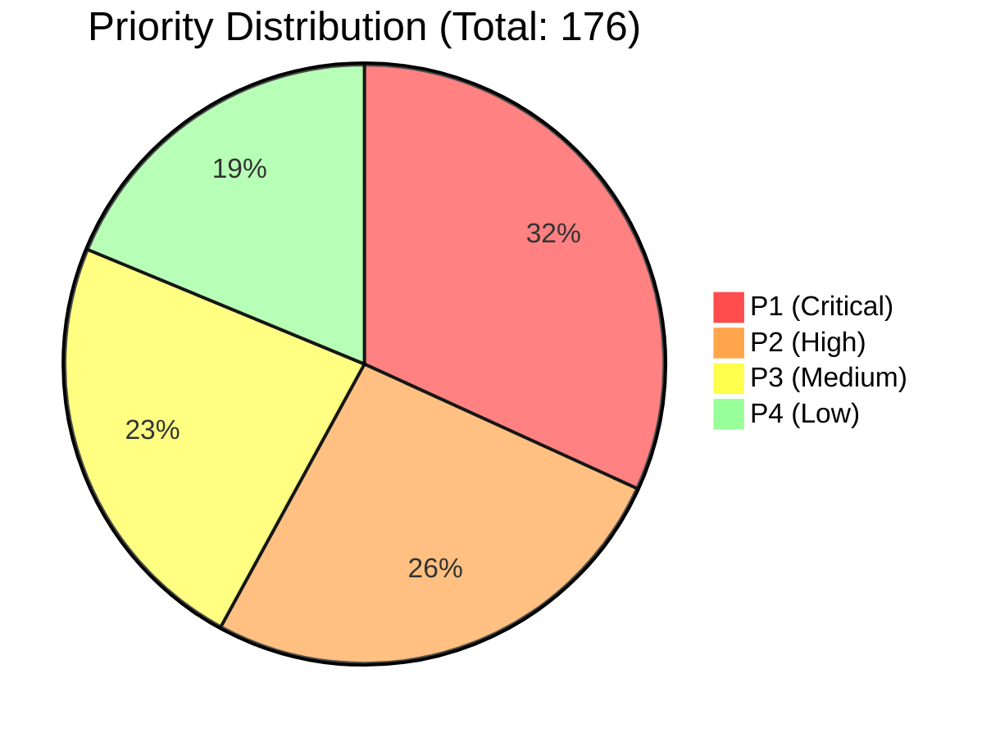
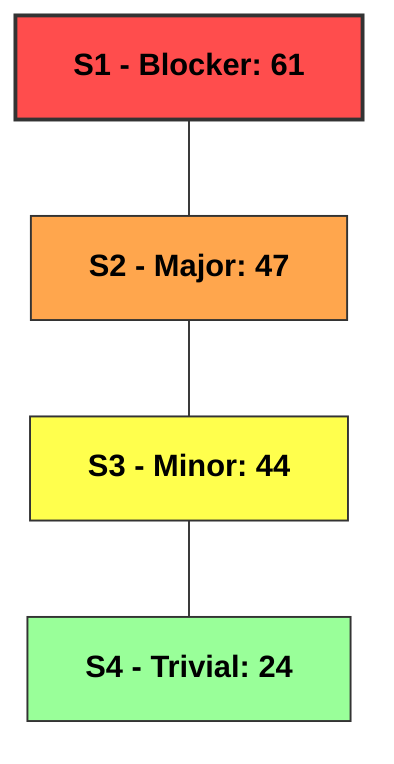
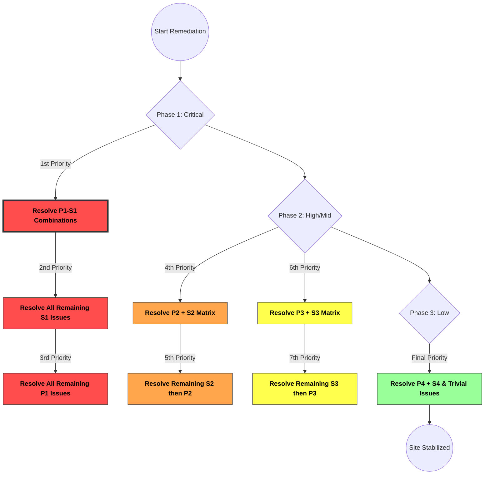
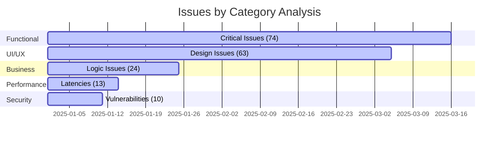

# 🛡️ Technical Report: Saudi E-Commerce Store
> **Quality Assurance Technical Comprehensive Analysis**

---

## 📑 General Information
| Property | Details |
| :--- | :--- |
| **👤 Prepared by** | Eng. Abdelrahman Abodief |
| **📅 Date** | January 29, 2025 |
| **🌐 Tested Website** | `[Restricted URL - Internal Environment]` |
| **📊 Interactive Bug Tracker** | [🎫 View Issues](https://github.com/Abdelrahman-AA/Saudi-ECommerce-Quality-Assurance-Audit/issues) |

---

## 💻 Test Environment

### **Operating Systems**
```text
  📱 Android 14 (One UI 6.1)
  💻 Windows 11 Pro
```

### **Browsers Used**
```text
  🌐 Chrome v131.0
  🦊 Firefox
  🌍 Microsoft Edge
```

---

## 🎯 Test Objectives

### 📱 UI & Compatibility
```text
  1. Verify UI responsiveness across various devices.
  2. Test web application compatibility with different operating systems.
  3. Verify if there are issues loading images or interactive content.
  4. Verify consistency of data display across different browsers.
```

### ⚙️ Functional & Logical Integrity
```text
  1. Ensure data integrity after product updates.
  2. Test correct interaction between user interfaces and backend systems.
  3. Test search and filtering operations using multiple criteria.
  4. Verify the accuracy of displaying filters and various product options.
  5. Evaluate form-user interaction during data entry and submission.
  6. Test the validity of entered data and the system's error validation.
  7. Ensure accuracy of information display after mathematical operations (e.g., prices or discounts).
  8. Check for issues in using integrated features like the shopping cart or user accounts.
  9. Verify the system's correct response to user input errors.
```

### ⚡ Performance & Scalability
```text
  1. Evaluate site performance during product addition, modification, and deletion.
  2. Verify system response when uploading multiple products simultaneously.
  3. Ensure there are no delays or browsing issues while navigating between pages.
  4. Test system stability when loading pages with dense information.
  5. Test the site's ability to handle high data volumes during product entry/modification.
  6. Test the impact of database changes on the user interface.
  7. Test the site's ability to reload and update information quickly and efficiently.
```

---

## 🔍 Discovered Issues
**Total Number of Issues:** `176`

### 📊 Issues Metrics Summary
| Priorities (P) | | Severity (S) |
| :--- | :---: | :--- |
| 🔴 **P1 (Critical):** 56 | | 🔥 **S1 (Blocker):** 61 |
| 🟠 **P2 (High):** 46 | | ⚠️ **S2 (Major):** 47 |
| 🟡 **P3 (Medium):** 41 | | 🛡️ **S3 (Minor):** 44 |
| 🟢 **P4 (Low):** 33 | | 🔵 **S4 (Trivial):** 24 |

---

### 📈 Priority Distribution


---

### 📈 Severity Distribution


---

## 🚀 Proposed Remediation Strategy

### 🔴 Phase 1: Critical Stabilization (High Urgency)
```text
  Resolve P1-S1 Issues: Prioritize P1 issues that relate to S1.
  Resolve S1 with any P: Address all S1 issues regardless of priority.
  Resolve P1 with any S: Handle remaining P1 issues regardless of severity.
```

### 🟠 Phase 2: Functional Refinement (Medium Urgency)
```text
  Resolve P2 & S2: Resolve P2/S2 combinations, then all S2, then all P2.
  Resolve P3 & S3: Resolve P3/S3 combinations, then all S3, then all P3.
```

### 🟢 Phase 3: Final Polish (Low Urgency)
```text
  Resolve P4 & S4: Finally, resolve P4/S4 combinations and remaining low issues.
```

### 🗺️ Remediation Strategy Matrix


---

## 🛠️ Issues Breakdown by Category
| Category | Count |
| :--- | :---: |
| ⚙️ Functional | 74 |
| 🎨 UI/UX | 63 |
| ⚖️ Business Policies | 24 |
| ⚡ Performance | 13 |
| 🔒 Security & Protection | 10 |

### 📊 Category Concentration


---
**For any inquiries or to discuss details, please contact me directly.**
📩 **[Abdelrahman Abodief](https://abdelrahmanabodief.wixsite.com/abodief-tester)**
